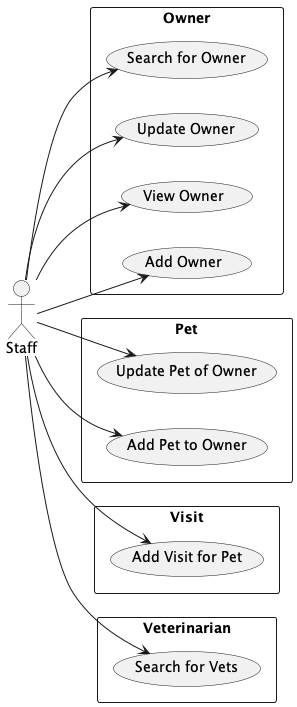

# Use Cases

These are the actors and use cases of the Epic Pet Clinic. The diagram was created
using [PlantUML](https://plantuml.com) and
an [Intellij IDEA plugin](https://plugins.jetbrains.com/plugin/7017-plantuml-integration) to preview and export the
diagrams shown here.

## Actors

### Staff

Any employee of the pet clinic who needs to manage owners and their pets as well as schedule visits for pets.

## Owner

The hoomans that own pets and require care from veterinarians.

### Search for Owner

Search for existing owners by last name. Can search by exact last name or partial last name matching the start of the
owner's last name. If no last name is specified then show all owners.

### Add Owner

Add new owner including their name nad basic contact information such as address and telephone number.

### View Owner

Show basic owner information along with any pets associated with the owner. For each pet show basic information about
the pet. For each pet show all known visits either past or future.

### Update Owner

Update owner name and contact information.

## Pet

All pets are related to owners. A pet cannot be related to more than one owner.

### Add Pet to Owner

Add new pet to an owner specifying pet name, date of birth, and type of pet.

### Update Pet of Owner

Update pet name, date of birth, and type of pet.

## Visit

Visits are intended as appointments. Adding a visit is analogous to scheduling an appointment.

### Add Visit for Pet

Add a visit for pet specifying the date and reason for the visit.

## Veterinarian

Veterinarians are those who provide care to pets.

### Search for Vets

Show all veterinarians including their name and speciality. 
