# Wireframes

Set of wireframes for the Epic Pet Clinic web application. Wireframes created using [Balsamiq](https://balsamiq.com) and
exported to the [images](images) directory.

## Table of Contents

- [Home](#home)
- [Owner](#owner)
    - [Search Owners](#search-owners)
    - [Owner Search Results](#owner-search-results)
    - [Add Owner](#add-owner)
    - [View Owner](#view-owner)
    - [Edit Owner](#edit-owner)
- [Pet](#pet)
    - [Add Pet](#add-pet)
    - [Edit Pet](#edit-pet)
- [Visit](#visit)
    - [Add Visit](#add-visit)
- [Vets](#vets)
- [Error](#error)

## Home

This is the application dashboard which currently contains an image of a puppy and kitten.

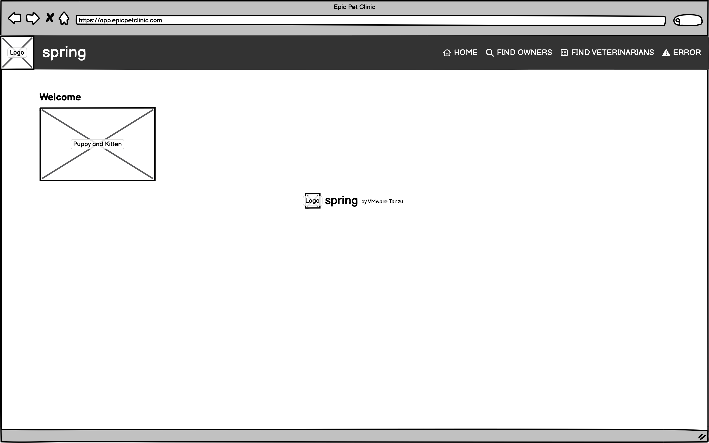

[Back to Top](#table-of-contents)

## Owner

### Search Owners

Search for owners by last name which needs to be either the exact last name or the beginning of the last name. When no
last name is provided then all owners are included in the search results. Click the *Find Owner* button to search owners
and you will be directed to the [Search Results](#owner-search-results) page.

To add new owners use the *Add Owner* button which would take you to the [Add Owner](#add-owner) page.

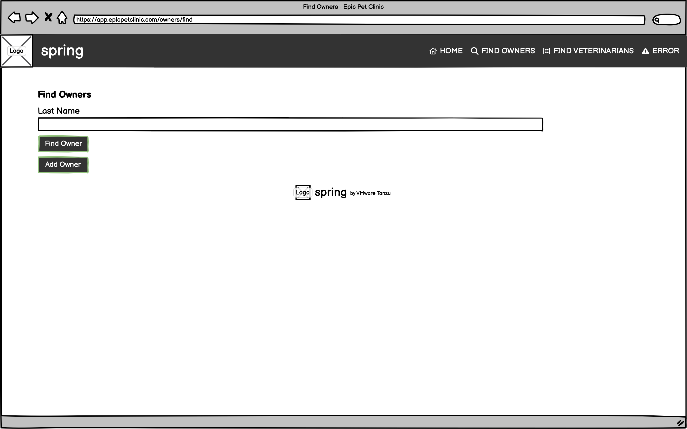

[Back to Top](#table-of-contents)

### Owner Search Results

Display the list of owners matching the search criteria. Page through list of owners using the links directly to
specific pages, the next and previous links, or the first page and last page links. View owner details by clicking their
name which will take you to the [View Owner](#view-owner) page.

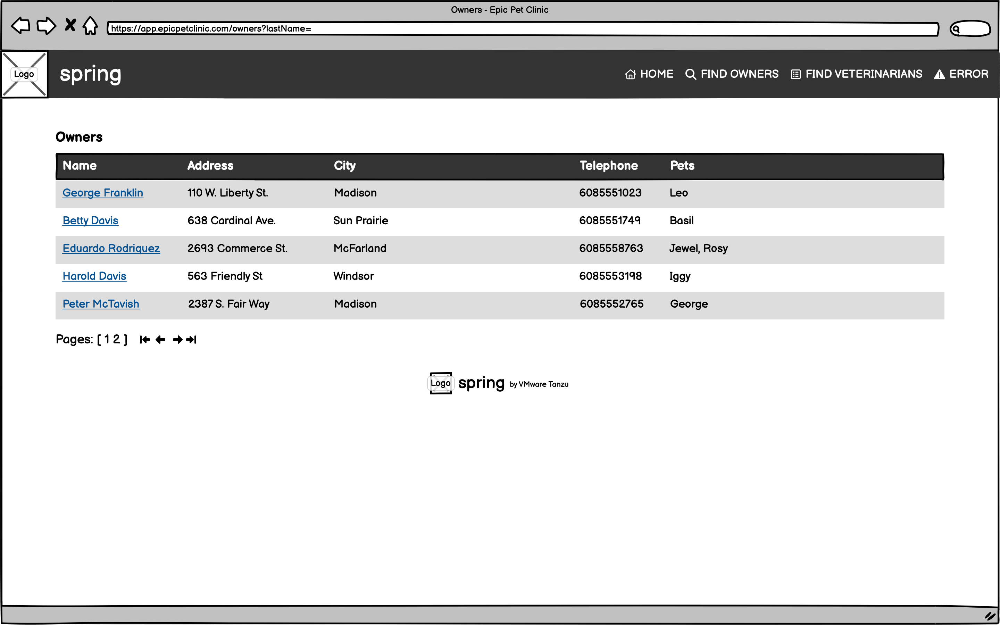

[Back to Top](#table-of-contents)

### Add Owner

Specify owner name and basic contact information. Click the *Add Owner* button to save the owner.

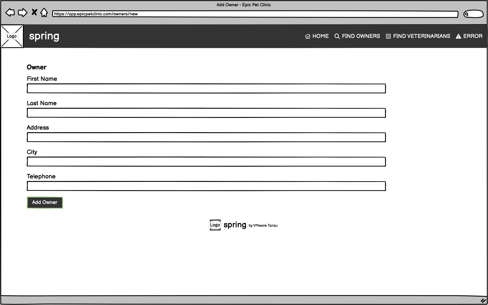

Upon successful save the user is directed to the [View Owner](#view-owner) page and receives a
notification that the owner was created.

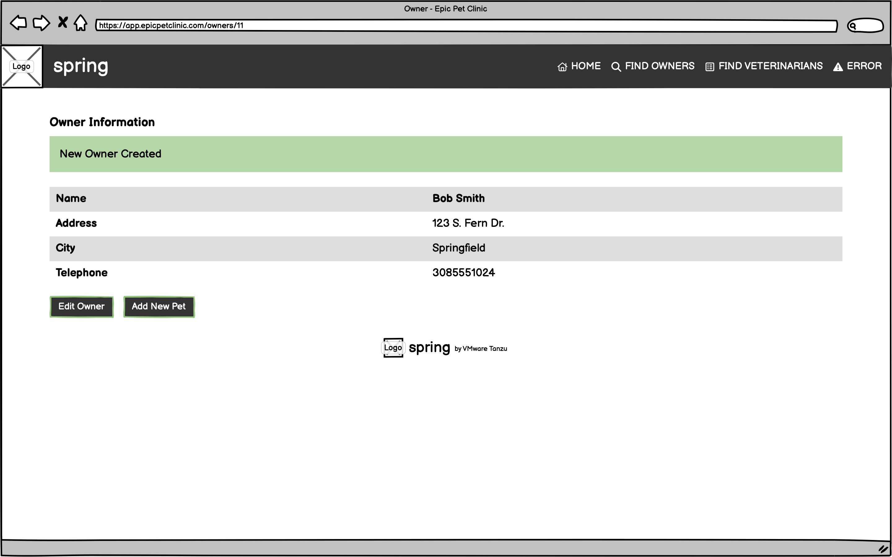

[Back to Top](#table-of-contents)

### View Owner

Show the owner name and basic contact information. If the owner has one or more pets then those pets are listed with
basic information about the pet. If there are any visits for each pet then those visits are displayed along with the
pet.

Click the *Edit Owner* button to make changes to the owner. The user is directed to the [Edit Owner](#edit-owner) page.
Click the *Add Pet* button to add a pet to the owner. The user is directed to the [Add New Pet](#add-pet) page.

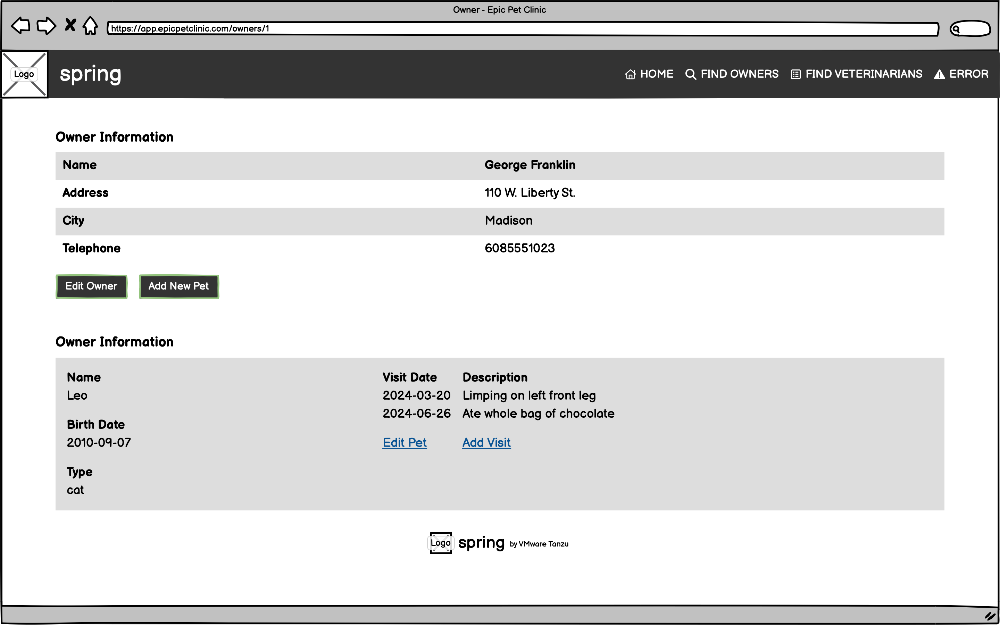

[Back to Top](#table-of-contents)

### Edit Owner

Change name and basic contact information of the owner. Click the *Update Owner* button to save changes.

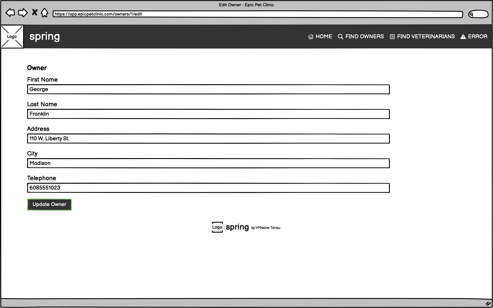

Upon successful save the user is directed to the [View Owner](#view-owner) page and receives a notification
that the owner was updated.

[Back to Top](#table-of-contents)

## Pet

Manage an owner's pets. An owner can have zero or more pets but it only makes sense for each owner to have at least one
pet that requires care. The application only supports adding and updating pets and showing the list of pets.

### Add Pet

From the [View Owner](#view-owner) page, click the *Add Pet* button to be directed to this page to enter basic pet
information such as name, birthdate, and type of pet. Click *Add Pet* to add the pet to the owner.

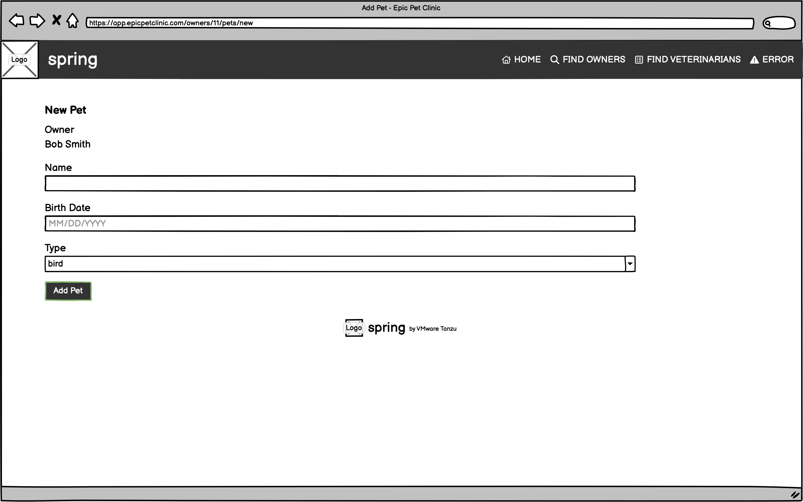

Upon successful save the user is directed to the [View Owner](#view-owner) page and receives a notification that the pet
was added.

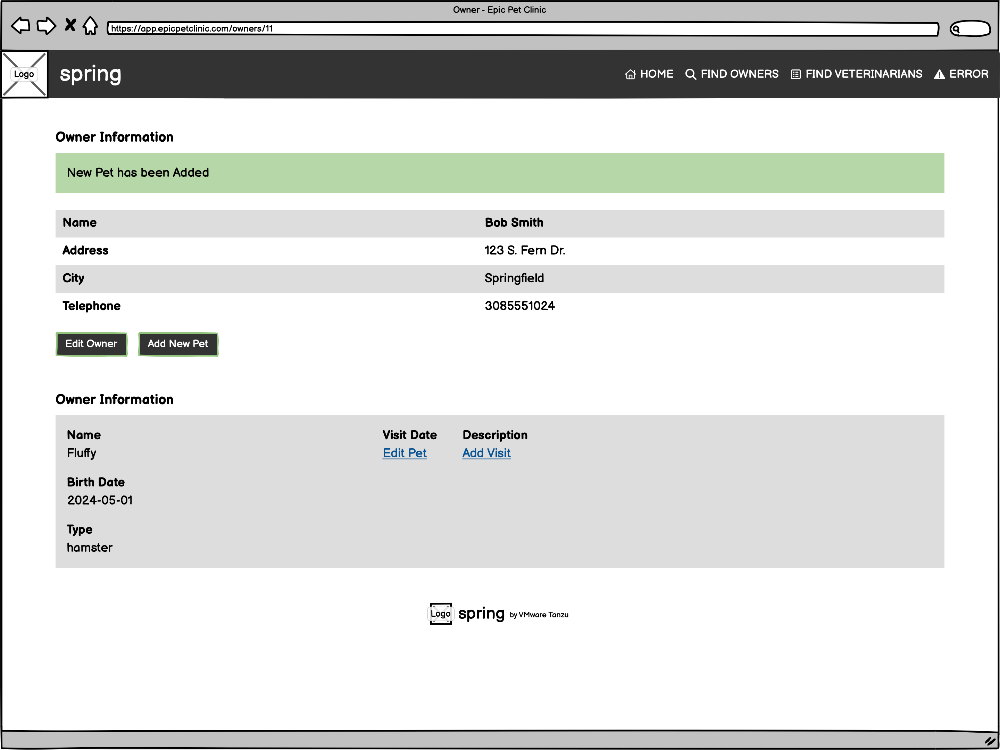

[Back to Top](#table-of-contents)

### Edit Pet

From the [View Owner](#view-owner) page, click the *Edit Pet* link of the pet to change to be directed to the this page
to update the basic pet information. Click the *Update Pet* button to save changes.

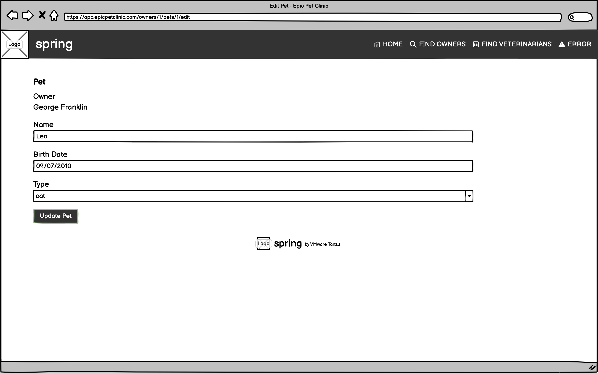

Upon successful save the user is directed to the [View Owner](#view-owner) page and receives a notification that the pet
was updated.

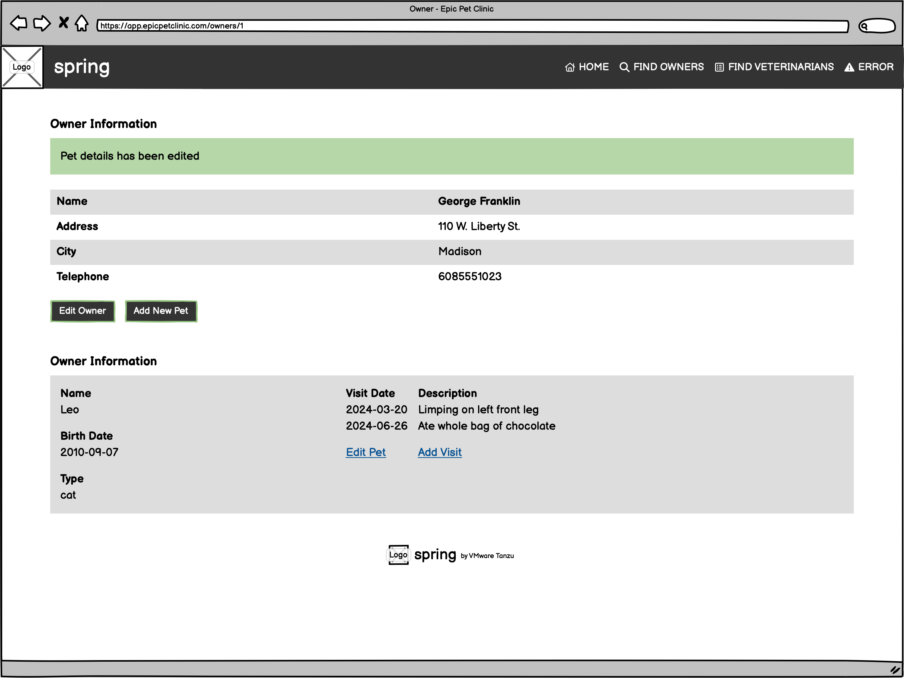

[Back to Top](#table-of-contents)

## Visit

Staff can schedule visits or view previously scheduled visits. Making changes to visits is not currently supported.

### Add Visit

From the [View Owner](#view-owner) page, Staff can review previous visits associated with each pet. To schedule a visit
click the *Add Visit* link of the desired pet. The user will be directed to this page. The page contains basic pet
information and owner name, fields to enter date of visit and reason for visit as well as a list of previous visits.
Click the *Add Visit* button to schedule the visit.

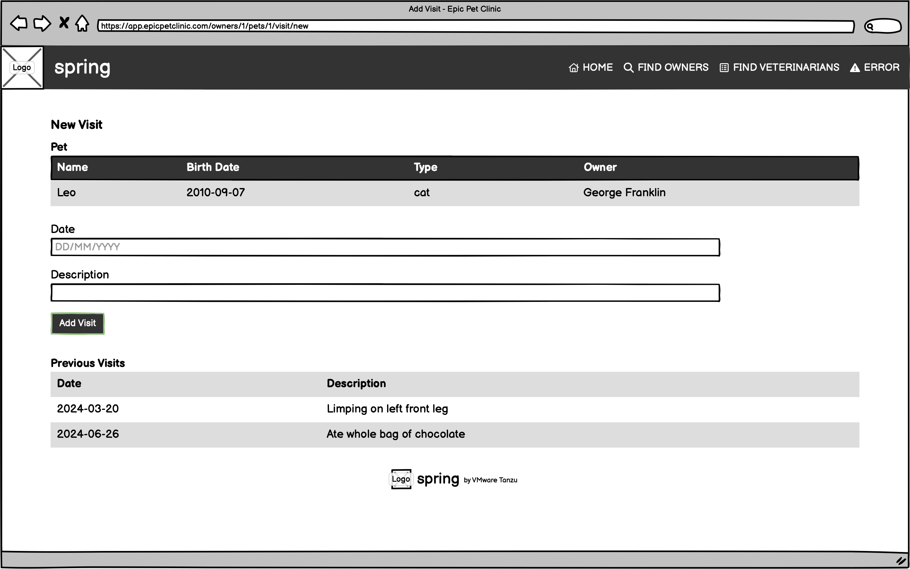

Upon successful save the user is directed to the [View Owner](#view-owner) page and receives a notification that the pet
was updated.

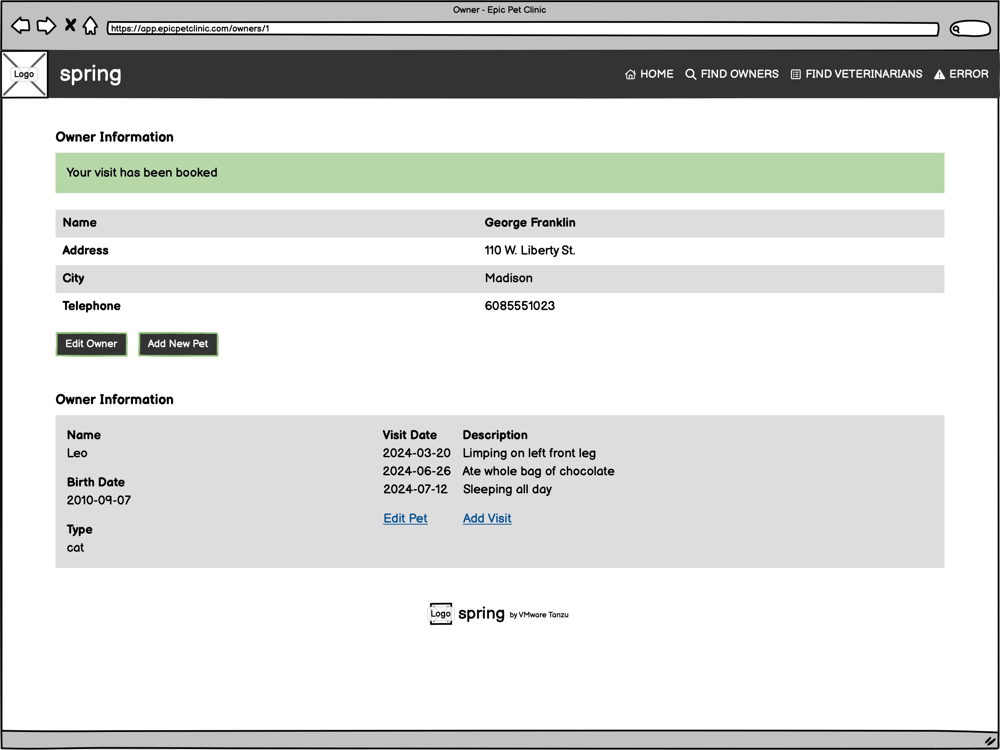

[Back to Top](#table-of-contents)

## Vets

This is a read-only list of veterinarians defined via SQL, there is no means to manage veterinarians in the user
interface. There are controls to navigate the results in the table including navigating to the next or previous pages
and navigating to the first and last pages.

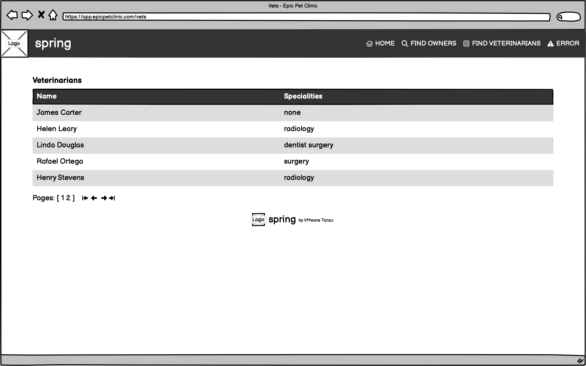

[Back to Top](#table-of-contents)

## Error

Used to demonstrate display of an error page using Spring. Like the home page, contains an image of a puppy and kitten.
If sent here by the server due to an actual error then the error message would be displayed.

[Back to Top](#table-of-contents)
